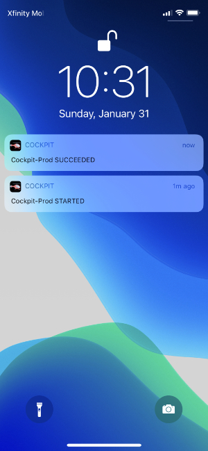

# Cockpit 🚁
##### An app that alerts you to the status of all your AWS Pipelines

## How it works
Receive key notifications from AWS (or elsewhere) as push notifications on any device.

## Installation
1. Create a new DB in your MySQL instance
2. Import the database structure from `Example DB.sql`
3. Update credentials in `config.ini.example`
  - VAPID keys can be generated by following the instructions at https://github.com/web-push-libs/web-push-php?tab=readme-ov-file#authentication-vapid. The `private_key.pem` can be deleted, we just need the `*_key.txt` files
4. Rename `config.ini.example` to `config.ini`
5. Deploy the code and visit the public UI
6. Register your device for notifications
  - For iOS, we recommend "Add to Home Screen" via the Share menu first

## Sending Notifications
For my personal setup, I mostly use the SNS topic. From the AWS Console:
1. Navigate to the Simple Notification Service page
2. Create a new topic
3. Create a new subscription
  - HTTPS
  - Endpoint: `https://<your url>/push.php`
4. It should automatically confirm the subscription
5. Using CloudWatch, setup triggers for whatever events necessary (ex: pipeline or alarms) and use the SNS topic
as the destination.

You can also post messages to `https://<your url>/push.php` using the `message` POST form field
